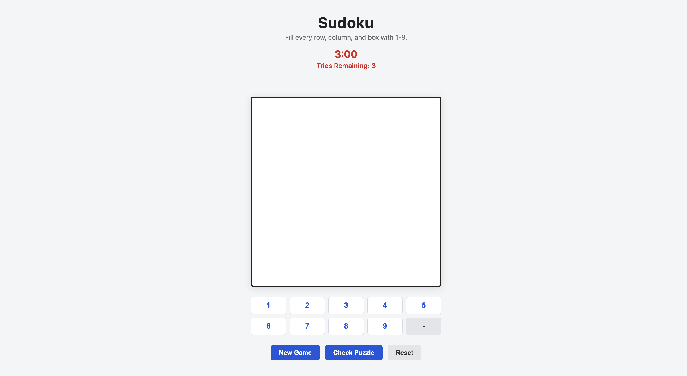

# Sudoku 

## About The Game 

Sudoku is a single-player puzzle game played on a 9x9 grid divided into a 3x3 grid where you have to fill every row and column with numbers 1-9 without any repeating in any box, column or row.

This is a browser based game of sudoku which is based on HTML , CSS , JavaScript. You pick the cell and fill it up with a number and it will validate it using JavaScript and the game's rules. I chose sudoku because it has clear winning conditions and clear logic which makes it a bit easier to program. 

## Getting Started 

https://github.com/ahm3dmohd/sudoku-game.git

## Attributions 

- W3 Schools 
- Youtube (https://www.youtube.com/watch?v=xpsm3tOLTVE)

## Technologies Used 

- HTML 
- CSS 
- JavaScript 
- Visual Code Studio (IDE)

## Next steps

- Keyboard input instead of just numberpad 
- Check number conflicts in the came cell block
- Difficulty levels like easy , medium , hard
- A pause button so it can stop the time and puzzle

## User Stories 

- As a user I want to select a cell and place a number there using the numberpad.
- As a user I want the incorrect cells highlighted in red and correct cells in green so I can fix my mistake.
- As a user I want a reset button so I can reset all my moves without losing the puzzle.
- As a user I want a new game button so I can start a new game once im done with the old one.
- As a user I want to have a check moves button so I can know which of my answers are correct and vice versa.
- As a user I want a timer so the game is more fun and challenging.

## Features 

- Timer 
- Tries Remaining
- Numberpad 
- New game , Reset , Check moves button

## Game Screenshot

